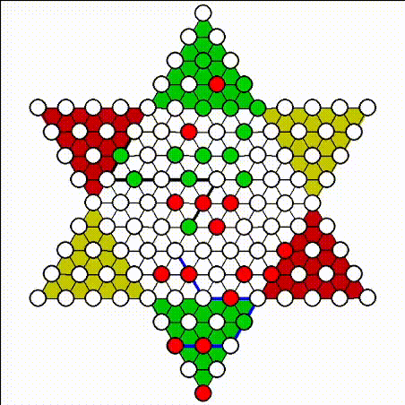

# Chinese Checkers

A chinese checkers game in pygame. Almost all the code was written in 2–3 days so it isn't the cleanest. Click on the pieces to move them, press the space bar to let the AI choose a move, press "r" to reset the board, and use control Z to undo a move. The blue line indicates what the AI suggests as the best move. The board is modeled of this real one I own,

More detail is given in my [blog post](https://www.kevincao.xyz/posts/chinese-checkers/).

# Screenshots

